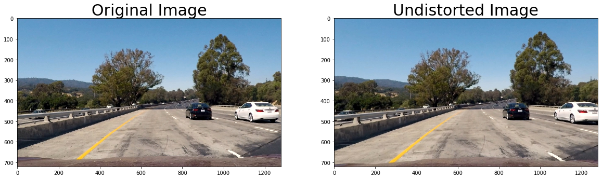
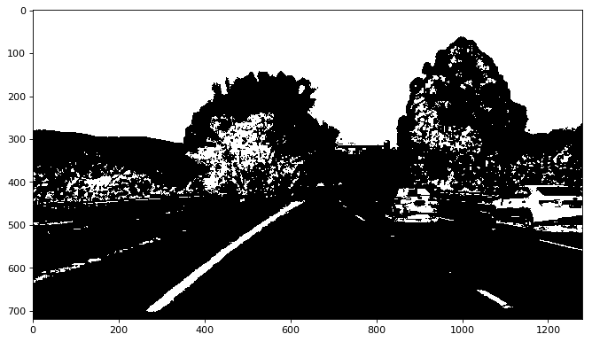
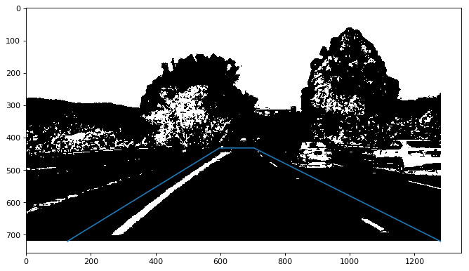
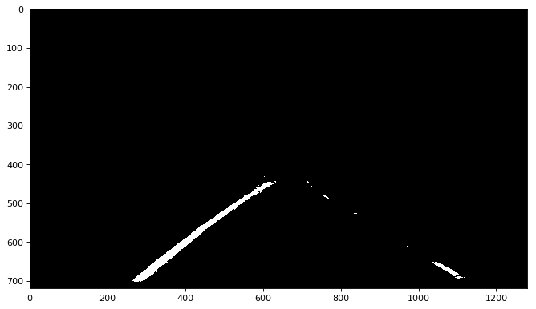
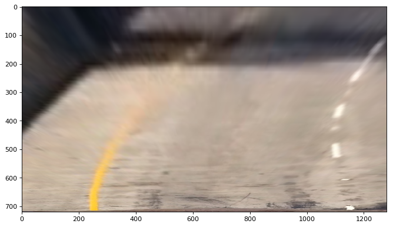
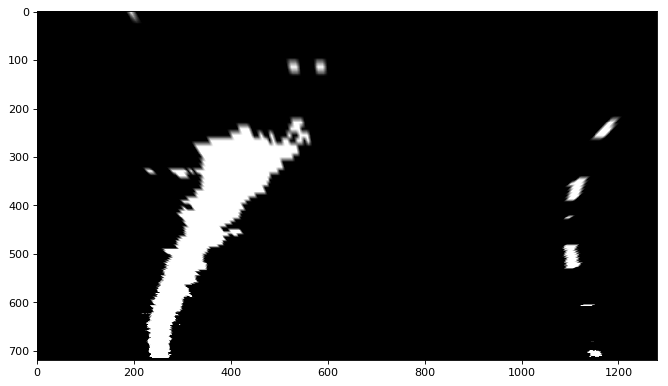
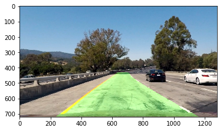
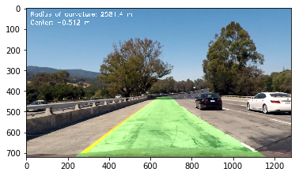

## Advance line detection

---

**Advanced Lane Finding Project**

The goals / steps of this project are the following:

* Compute the camera calibration matrix and distortion coefficients given a set of chessboard images.
* Apply a distortion correction to raw images.
* Use color transforms, gradients, etc., to create a thresholded binary image.
* Apply a perspective transform to rectify binary image ("birds-eye view").
* Detect lane pixels and fit to find the lane boundary.
* Determine the curvature of the lane and vehicle position with respect to center.
* Warp the detected lane boundaries back onto the original image.
* Output visual display of the lane boundaries and numerical estimation of lane curvature and vehicle position.

[//]: # (Image References)

[image1]: ./misc/undistort_output.png "Undistorted"
[image2]: ./test_images/test1.jpg "Road Transformed"
[image3]: ./misc/binary_combo_example.jpg "Binary Example"
[image4]: ./misc/warped_straight_lines.jpg "Warp Example"
[image5]: ./misc/color_fit_lines.jpg "Fit Visual"
[image6]: ./misc/example_output.jpg "Output"
[video1]: ./project_video.mp4 "Video"

## [Rubric](https://review.udacity.com/#!/rubrics/571/view) Points

### Here I will consider the rubric points individually and describe how I addressed each point in my implementation.  

---

### Writeup / README

#### 1. Provide a Writeup / README that includes all the rubric points and how you addressed each one.  You can submit your writeup as markdown or pdf.  [Here](https://github.com/udacity/CarND-Advanced-Lane-Lines/blob/master/writeup_template.md) is a template writeup for this project you can use as a guide and a starting point.  

You're reading it!

### Camera Calibration

#### 1. Briefly state how you computed the camera matrix and distortion coefficients. Provide an example of a distortion corrected calibration image.

The code for this step is contained in the "Calibrarion Camera" Section of the IPython notebook located in "./LineFinder.ipynb".  

I start by preparing "object points", which will be the (x, y, z) coordinates of the chessboard corners in the world. Here I am assuming the chessboard is fixed on the (x, y) plane at z=0, such that the object points are the same for each calibration image.  Thus, `objp` is just a replicated array of coordinates, and `objpoints` will be appended with a copy of it every time I successfully detect all chessboard corners in a test image.  `imgpoints` will be appended with the (x, y) pixel position of each of the corners in the image plane with each successful chessboard detection.  

I then used the output `objpoints` and `imgpoints` to compute the camera calibration and distortion coefficients using the `cv2.calibrateCamera()` function.  I applied this distortion correction to the test image using the `cv2.undistort()` function.
Here you can see the chess board undistorted image result. 

![alt text][image1]

And here you can see one frame from the video.

### Pipeline (single images)

Below you will see the step by step pipeline process of detecting the road marking lines.

#### 1. Removing distortion

After extracting the `mtx`, `dist` from the set of images with the chessboard, I use OpenCV function `undistort()` to remove the distortion from the images. As you saw above the image on the left, become the image on the right.

#### 2. Treshhollding the image.

As you can see in the "./LineFinder.ipynb" file, I have tried different Thresholding methods, like:

1. Directional sobel filters wrt X
2. Directional sobel filters wrt Y
3. Magnitude sobel filters (with different thresholds)
And few others.

I also tried to convert the RGB image channels to HLS and plot the separetely.
From all of the test I made, S channel from HLS + V channel from HSV in combination with Directional sobel filters wrt X & Y were the most informative ones, as it always showed the lines the most.

Here you can see what the final results looks like (Threshgolding parameters are present in **ipynb**):

#### 3. Selecting Region Of Interest (ROI)

Then next thing is to select the ROI as there is a lor of noise around the imagem but we are only interested in the region shown below:

So we crop it, and get the image that is not can be used to find lines:

#### 4. Perspective transform

Next step is perspective transform. Using that it is easier to extract the curviture of the road, compare to the the normal images. Here waht it looks like.
Original image:

Treshholded image:

Source and destination points can be found in the ipynb file (line 26).

#### 5. Histogram / Sliding window

First, I took histogram lower half of binary perspective image and used sliding window technique to locate left and right lane line points and wraped those steps in hist_analysis() function.

After utilize hist_analysis() to get left and right lane line points, I use np.polyfit() to fit left and right lane line points to get 2nd order polynomial parameters left_fit and right_fit for left and right lane line, respectively. 

And at the next step in `plot_metrics()` I extract the Line curviture and distance of the car from the center of the middle of the road (cell #86).

![alt text][image5]

#### 6. Smoothing

To avoid noisy 

#### 7. Plotting.

Then next step is to draw a road mask, which is done in cell #40, function `draw_road_mask()`.

#### 8. Metrics

And at last I add the metrics to the image, and the final results looks as following:

---

### Pipeline (video)

Here's a [link to my video result](./project_video_out.mp4)

---

# DISCUSSION

1. Briefly discuss any problems / issues you faced in your implementation of this project. Where will your pipeline likely fail? What could you do to make it more robust?

For given above show video and images pipeline show quite good performance. As the scene was recorded in the highway where the roads are straight and road marking is visible very well.

However pipeline fails to run on wavy road with a lot of color distortion like here:

Other potential problems could be:

* Different road line marking (different coutries/regions)
* Absence of road line marking (if erased/old, outside city road)
* Invisibility of the lines due to snow/sand.
* and this:

**How to overcome these:**

* Tune the parameters on the scenes with different light/weather conditions (night/snow)
* Train NN to produce mask of the road, then we can use that to predict the possible route/line can is at (that would work for case when there is no lane lines at all) 
