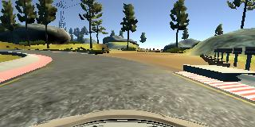
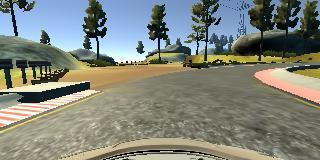

#**End-to-end steering the driving wheel** 


The goals / steps of this project are the following:

* Use the simulator to collect data of good driving behavior
* Build, a convolution neural network in Keras that predicts steering angles from images
* Train and validate the model with a training and validation set
* Test that the model successfully drives around track one without leaving the road
* Summarize the results with a written report

## Rubric Points
###Here I will consider the [rubric points](https://review.udacity.com/#!/rubrics/432/view) individually and describe how I addressed each point in my implementation.  

---
###Files Submitted & Code Quality

####1. All required files are included and can be used to run the simulator in autonomous mode

My project includes the following files:

* **model.py** - containing the script to create and train the model
* **drive.py** - for driving the car in autonomous mode
* **model.h5** - containing a trained convolution neural network 

####2. Functional code
Using the [Udacity simulator](https://github.com/udacity/self-driving-car-sim) and my drive.py file, the car can be driven autonomously around the track by executing 
```
python drive.py model.h5
```

####3. Submission code is usable and readable

The **model.py** file contains the code for training and saving the convolution neural network. The file shows the pipeline I used for training and validating the model, and it contains comments to explain how the code works.

###Model Architecture and Training Strategy

####1. An appropriate model architecture has been employed

My model consists of the following layers and was inspired by NVIDIA's model from [here](https://devblogs.nvidia.com/parallelforall/deep-learning-self-driving-cars/):

```
Layer (type)                 Output Shape              Param #   
=================================================================
cropping2d_1 (Cropping2D)    (None, 90, 320, 3)        0         

batch_normalization_1 (Batch (None, 90, 320, 3)        12        
_________________________________________________________________
conv2d_1 (Conv2D)            (None, 90, 320, 8)        32        
_________________________________________________________________
conv2d_2 (Conv2D)            (None, 43, 158, 16)       3216      
_________________________________________________________________
conv2d_3 (Conv2D)            (None, 20, 77, 32)        12832     
_________________________________________________________________
conv2d_4 (Conv2D)            (None, 8, 37, 64)         51264     
_________________________________________________________________
batch_normalization_2 (Batch (None, 8, 37, 64)         256       
_________________________________________________________________
conv2d_5 (Conv2D)            (None, 6, 35, 128)        73856     
_________________________________________________________________
conv2d_6 (Conv2D)            (None, 4, 33, 128)        147584    
_________________________________________________________________
flatten_1 (Flatten)          (None, 16896)             0         
_________________________________________________________________
dropout_1 (Dropout)          (None, 16896)             0         
_________________________________________________________________
batch_normalization_3 (Batch (None, 16896)             67584     
_________________________________________________________________
dense_1 (Dense)              (None, 512)               8651264   
_________________________________________________________________
dropout_2 (Dropout)          (None, 512)               0         
_________________________________________________________________
batch_normalization_4 (Batch (None, 512)               2048      
_________________________________________________________________
dense_2 (Dense)              (None, 256)               131328    
_________________________________________________________________
dropout_3 (Dropout)          (None, 256)               0         
_________________________________________________________________
dense_3 (Dense)              (None, 64)                16448     
_________________________________________________________________
dense_4 (Dense)              (None, 1)                 65        
=================================================================
Total params: 9,157,789.0
Trainable params: 9,122,839.0
Non-trainable params: 34,950.0
_________________________________________________________________
```

The model uses a combination of 2d convolutional (Conv2D) and fully connected (Dense) layers. Batch normalization and dropout (with probability of 50%) are applied at the different stage to allow network converge faster and avoid overfitting.
The model includes RELU layers for the first 6 convolutional layers to introduce nonlinearity. 

####2. Attempts to reduce overfitting in the model

As already mentioned the model contains dropout layers in order to reduce overfitting. 

The model was trained and validated on different data sets to ensure that the model was not overfitting. The model was tested by running it through the simulator and ensuring that the vehicle could stay on the track. The video record record is present **run1.mp4**

####3. Model parameter tuning

The model used an adam optimizer, so the learning rate was not tuned manually.

####4. Appropriate training data

Training data was chosen to keep the vehicle driving on the road. I used a combination of center lane driving, recovering from the left and right sides of the road ... 

Also the recording was made on the different tracks to make the dataset more representative.

For details about how I created the training data, see the next section. 

###Model Architecture and Training Strategy

####1. Solution Design Approach

The overall strategy for deriving a model architecture was to change the model presented by NVIDIA's [here](https://devblogs.nvidia.com/parallelforall/deep-learning-self-driving-cars/):

My first step was to flatten the input image apply few fully connected layers and train the model to see how it performs. Obviously the MSE while the training was too hig and the while the model was tested in simulator car just made circles or other random wheel rotations. Luckily it was just a simulator not the real car.

By flattening the image we do lose the structure that present in it. Convolutional Neural networks are popular and well know for producing good results on the task that involve image data. The next step was to stick few Convolutional layers together (structure was similar to [LeNet](yann.lecun.com/exdb/lenet/) model. This times results were much better but still not quite good, because the car was after sometime would drive itself to the lake.

What's next? Of course we are working with **Deep** Learning here. What do we do? We go Deeper.

There was an interesting post by [NVIDIA](https://devblogs.nvidia.com/parallelforall/deep-learning-self-driving-cars/) where they explaned exactly the task I was trying to achive, designing an End-to-end model to drive a car. 

Inspired by their model which looks as following:


and not wanting to replicate exact structure the network that is explained in next section was derived.

####2. Final Model Architecture

Model architecture

```
Layer (type)                 Output Shape              Param #   
=================================================================
cropping2d_1 (Cropping2D)    (None, 90, 320, 3)        0         

batch_normalization_1 (Batch (None, 90, 320, 3)        12        
_________________________________________________________________
conv2d_1 (Conv2D)            (None, 90, 320, 8)        32        
_________________________________________________________________
conv2d_2 (Conv2D)            (None, 43, 158, 16)       3216      
_________________________________________________________________
conv2d_3 (Conv2D)            (None, 20, 77, 32)        12832     
_________________________________________________________________
conv2d_4 (Conv2D)            (None, 8, 37, 64)         51264     
_________________________________________________________________
batch_normalization_2 (Batch (None, 8, 37, 64)         256       
_________________________________________________________________
conv2d_5 (Conv2D)            (None, 6, 35, 128)        73856     
_________________________________________________________________
conv2d_6 (Conv2D)            (None, 4, 33, 128)        147584    
_________________________________________________________________
flatten_1 (Flatten)          (None, 16896)             0         
_________________________________________________________________
dropout_1 (Dropout)          (None, 16896)             0         
_________________________________________________________________
batch_normalization_3 (Batch (None, 16896)             67584     
_________________________________________________________________
dense_1 (Dense)              (None, 512)               8651264   
_________________________________________________________________
dropout_2 (Dropout)          (None, 512)               0         
_________________________________________________________________
batch_normalization_4 (Batch (None, 512)               2048      
_________________________________________________________________
dense_2 (Dense)              (None, 256)               131328    
_________________________________________________________________
dropout_3 (Dropout)          (None, 256)               0         
_________________________________________________________________
dense_3 (Dense)              (None, 64)                16448     
_________________________________________________________________
dense_4 (Dense)              (None, 1)                 65        
=================================================================
Total params: 9,157,789.0
Trainable params: 9,122,839.0
Non-trainable params: 34,950.0
_________________________________________________________________
```

In order to gauge how well the model was working, I split my image and steering angle data into a training and validation set. 

The training was done multiple time to find propers numbers for number of epochs and dropout probabilites.

The final step was to run the simulator to see how well the car was driving around track one. At it was the moment when it did it first full lap without even touching road marking lines.

Further some more data was gathered for recovering the car from the side of the road and model was retrained again. Car was placed at the sides of the road few times and could recover succesfully.

####3. Creation of the Training Set & Training Process

To capture good driving behavior, I first recorded two laps on track one using center lane driving. Here is an example image of center lane driving:


Then I repeated this process on track two in order to get more data points.

To augment the dataset, I also flipped images thinking that this would allow me to balance the dataset for the left and right steers. For example, here is a Normal and Flipped images shown:




After the collection process, I had 47319 data points. I then after augmenting flipped version I got 94638 of them.

I finally randomly shuffled the data set and put 30% of the data into a validation set. 

I used this training data for training the model. The validation set helped determine if the model was over or under fitting. The ideal number of epochs was around 50 as evidenced by increase in the loss. I used an adam optimizer so that manually training the learning rate wasn't necessary.
